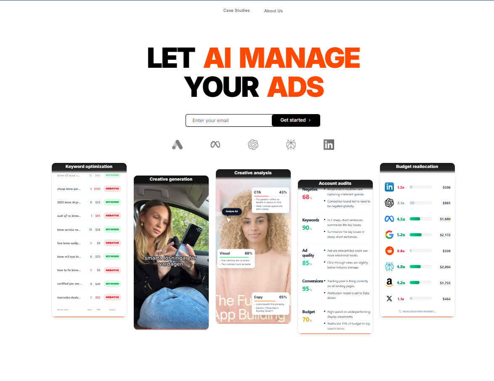
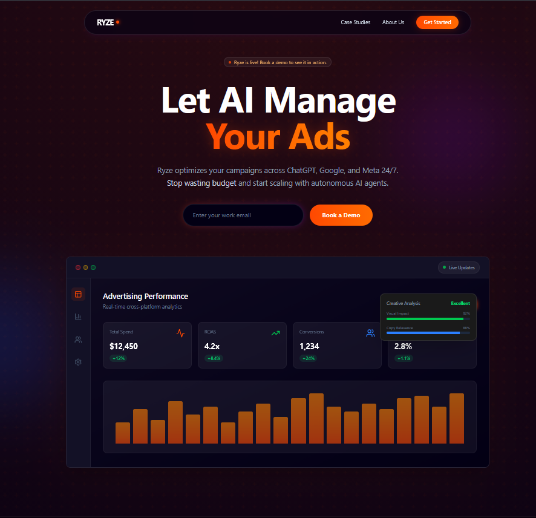
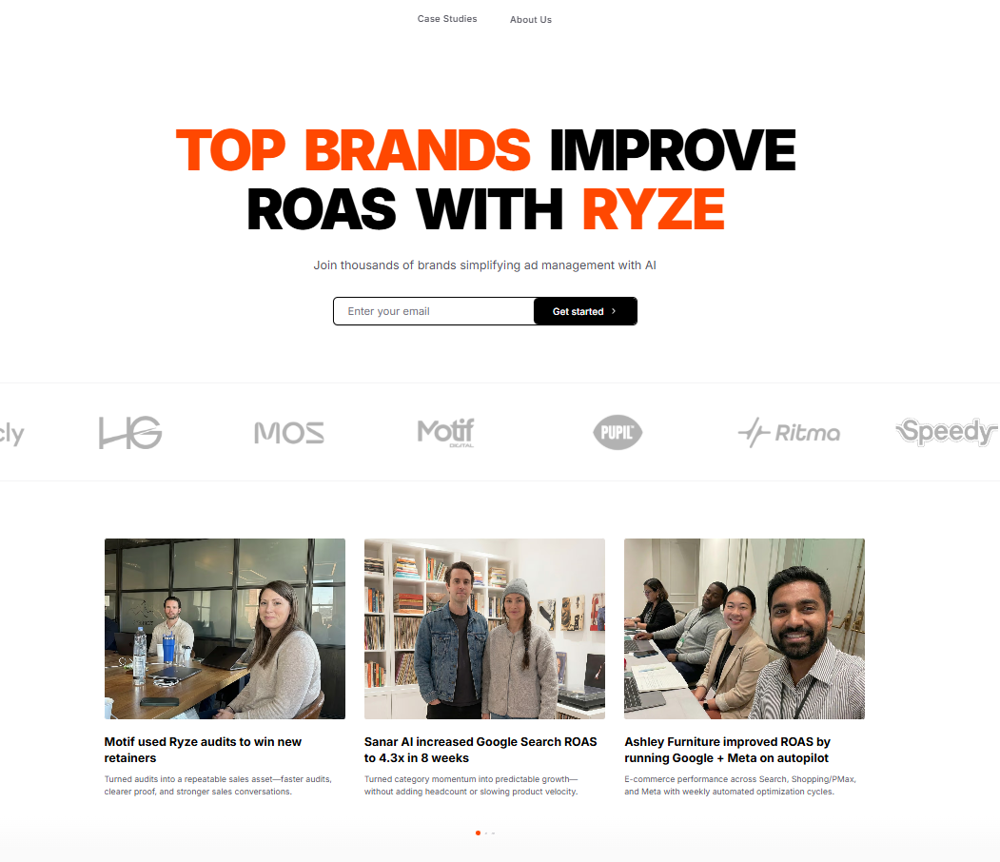
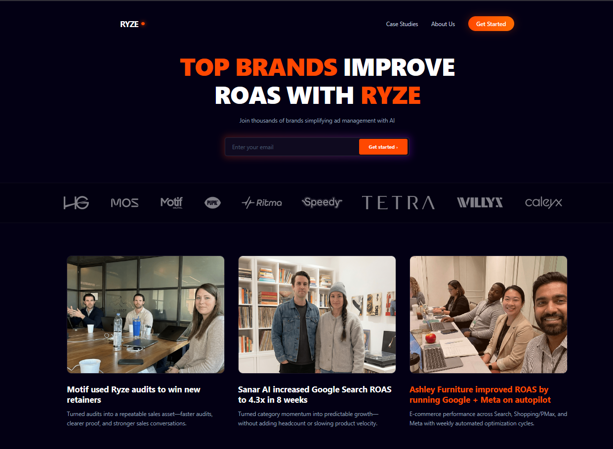

# Ryze Website Redesign

## Project Overview

This project is a high-fidelity redesign of the [Ryze](https://www.get-ryze.ai/) website, developed as a frontend engineering assignment. The primary objective was to modernize the user interface, enhance the user experience with fluid animations, and implement a responsive, component-driven architecture using React.

The application replicates the core value proposition of Ryze—an autonomous AI for ad management—through a sleek, dark-themed aesthetic that emphasizes trust, premium quality, and technological sophistication.

##  Visual Transformation

A side-by-side comparison illustrating the design evolution from the original concept to the final high-fidelity implementation.

### Landing Page
| Before | After |
| :---: | :---: |
|  |  |

### Case Studies
| Before | After |
| :---: | :---: |
|  |  |

##  Technology Stack

- **Core Framework:** [React](https://react.dev/) (v18) with [Vite](https://vitejs.dev/)
- **Styling:** [Tailwind CSS](https://tailwindcss.com/) (v3) - Utility-first styling for rapid development.
- **Animations:** [Framer Motion](https://www.framer.com/motion/) - Complex layout transitions and scroll-based effects.
- **Icons:** [Lucide React](https://lucide.dev/) - Consistent and lightweight icon set.
- **Routing:** [React Router DOM](https://reactrouter.com/) - Client-side routing for navigating between Landing and Case Studies pages.

##  Architecture & Folder Structure

The project follows a scalable, feature-based directory structure designed for maintainability and separation of concerns.

```bash
redesign-ryze/
├── public/              
├── src/
│   ├── assets/          
│   │   └── images/      
│   ├── components/      
│   │   ├── Navbar.jsx         
│   │   ├── Hero.jsx             
│   │   ├── LogoWall.jsx         
│   │   ├── Features.jsx         
│   │   ├── ComparisonSection.jsx
│   │   ├── WallOfLove.jsx      
│   │   └── Footer.jsx           
│   ├── pages/           
│   │   ├── LandingPage.jsx      
│   │   └── CaseStudies.jsx      
│   ├── App.jsx         
│   ├── main.jsx         
│   └── index.css        
├── tailwind.config.js   
└── package.json         
```

##  Key Features & Implementation Details

### 1. **Dynamic Dashboard Preview (`Hero.jsx`)**
Instead of using a static image, the hero section features a constructed React component that simulates the Ryze dashboard. This includes animating charts and floating status cards (`Creative Analysis`, `ROAS`) to give visitors an immediate sense of the product's "live" nature.

### 2. **Infinite Logo Wall (`LogoWall.jsx`)**
A custom infinite scroll implementation was created using Tailwind and CSS keyframes (`animate-infinite-scroll`). 
- **Challenge:** JS-based animations can be jittery on main threads.
- **Solution:** Utilized GPU-accelerated CSS animations with duplicate logo sets to create a seamless, non-blocking marquee effect.

### 3. **Bento Grid Layouts (`Features.jsx`)**
The features section uses a "Bento Box" grid design popular in modern SaaS.
- Responsive grid that transitions from 1 column (mobile) to 5 columns (desktop).
- Cards like "Budget Reallocation" and "Account Audits" were specifically optimized to be data-dense yet visually compact.

### 4. **Immersive "Dark Mode" Aesthetic**
- **Backgrounds:** Deep navy/black (`#030014`) with subtle ambient radial gradients to create depth.
- **Glassmorphism:** Used `backdrop-blur` and semi-transparent borders (`border-white/10`) to create a layered, modern feel.
- **Primary Accent:** Strong usage of Ryze Orange (`#FF4801`) to guide user attention to CTAs and key metrics.

##  Application Flow

1.  **Landing Page (`/`)**: 
    -   **Hero**: Hooks the user with a value prop + visual demo.
    -   **Social Proof**: Logo wall establishes immediate credibility.
    -   **Problem/Solution**: Comparison section shows why Ryze is better than generic AI.
    -   **Features**: Detailed breakdown of specific capabilities.
    -   **Testimonials**: Real user feedback ("Wall of Love").
    -   **CTA**: Final push to audit account.

2.  **Case Studies (`/case-studies`)**:
    -   Accessible via Navbar.
    -   showcases detailed success stories with specific ROAS improvements.
    -   Maintains stylistic consistency with the landing page.

##  How to Run Locally

1.  **Clone the repository:**
    ```bash
    git clone <repository_url>
    cd redesign-ryze
    ```

2.  **Install dependencies:**
    ```bash
    npm install
    ```

3.  **Start the development server:**
    ```bash
    npm run dev
    ```

4.  **Build for production:**
    ```bash
    npm run build
    ```

##  Challenges Solved

-   **Production Asset Loading:** Fixed issues where logo images would break in Vercel/production builds by switching from string paths to ES6 Module imports.
-   **Performance:** Optimized animations to use CSS transforms instead of layout-thrashing properties.
-   **Responsive Design:** Ensured complex components like the Dashboard Preview and Logo Wall scale gracefully from mobile to 4k screens.

---
*Submitted by Yashvi Saini*
